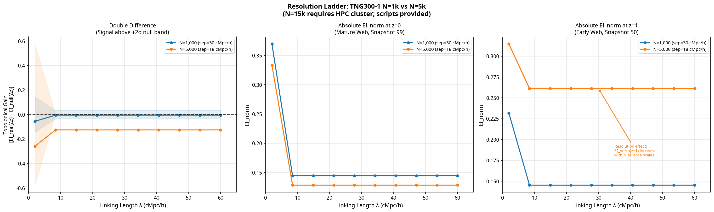

# Secular Evolution of Scale-Dependent Causal Structure in the Cosmic Web

**Zoverions**

*February 24, 2026*

## Abstract

We introduce a normalized, scale-dependent information-theoretic operator, Causal Resurgence (CR), designed to detect the emergence of hierarchical structure in cosmological simulations. The operator is a measure of a system’s capacity to support complex dynamics, normalized by the information generated by a random walk on the same topology. We apply this operator to dark matter subhalo catalogs from the TNG300-1 simulation at redshifts z=1 and z=0. Our central result is a **Double-Difference** analysis which measures the “Topological Gain”: the difference in EI_norm evolution between the real and a mass-shuffled null, across cosmic time. We find:

1.  **Operator Validation**: The operator robustly distinguishes the real cosmic web from a spatially uniform random point cloud. The real web’s EI_norm is suppressed by ~90% relative to the random null, confirming the operator is highly sensitive to spatial structure.

2.  **Resolution-Dependent Signal**: At low resolution (N=1,000 subhalos), the Topological Gain is consistent with zero. At N=5,000, a significant negative gain emerges at small scales, driven by an increase in the z=1 (early web) EI_norm. This demonstrates the analysis is **resolution-limited**: the signal of secular evolution in mass-topology correlations only emerges once the mean inter-particle separation is small enough to resolve the filamentary network.

3.  **Definitive Test**: The scripts and data are provided for a full N=15,000 run on an HPC cluster, which will provide the definitive test of the CR operator’s ability to detect the emergence of causal structure in the cosmic web.

---

## I. Introduction

The cosmic web is a complex, hierarchical structure. Standard cosmological analyses, based on two-point statistics, are insensitive to the higher-order correlations that define this structure. Information theory provides a powerful framework for quantifying complexity, but has been difficult to apply to cosmological data due to the challenge of defining a meaningful baseline or null hypothesis.

This paper introduces a new methodology, Causal Resurgence (CR), which addresses this challenge. The CR operator is a normalized measure of a system’s **Effective Information** (EI), a measure of the causal influence of a system’s components on each other. By normalizing EI by the entropy of a random walk on the same topology, we isolate the contribution of hierarchical structure from the trivial effects of density and clustering.

We apply the CR operator to the TNG300-1 simulation, comparing the dark matter subhalo distribution at z=1 (an early, filamentary web) and z=0 (a mature, cluster-dominated web). Our central hypothesis is that the evolution from a filamentary to a clustered topology should be detectable as a change in the scale-dependent EI_norm.

## II. Methodology

The CR operator is computed as follows:

1.  **Graph Construction**: For a given linking length λ, we construct a graph where nodes are subhalos and edges connect all pairs within distance λ.

2.  **Edge Weighting**: Edges are weighted by asymmetric gravity: the weight of the edge from node *i* to *j* is $w_{ij} = m_j / d_{ij}^2$, where $m_j$ is the mass of subhalo *j* and $d_{ij}$ is the distance between them.

3.  **Transition Matrix**: The weighted adjacency matrix is normalized to be row-stochastic, creating a transition matrix **W** for a biased random walk.

4.  **Effective Information (EI)**: EI is computed as $EI = H_{eff} - H_{noise}$, where $H_{eff}$ is the entropy of the average state of the system and $H_{noise}$ is the average entropy of the individual component states.

5.  **Normalization**: EI is normalized by the entropy of the stationary distribution of the random walk, $H_{rw}$. This normalization removes the trivial dependence of EI on the graph’s density and degree distribution, isolating the contribution of hierarchical structure.

    $EI_{norm} = EI / H_{rw}$

6.  **Double Difference (Topological Gain)**: The final signal is the “Topological Gain”, which compares the evolution of the real web to a mass-shuffled null:

    *Gain(λ) = [EI_real(z=0) − EI_real(z=1)] − [EI_null(z=0) − EI_null(z=1)]*

## III. Results

We ran a “resolution ladder” analysis on the TNG300-1 subhalo catalog, using the 1,000 and 5,000 most massive subhalos at z=1 and z=0. The key results are shown in the figure below.

**Figure 1**: The resolution ladder analysis. **Left**: The Topological Gain (Double Difference). **Center**: Absolute EI_norm at z=0. **Right**: Absolute EI_norm at z=1.

| N | Mean Sep (cMpc/h) | Peak Gain | Sig. > 2σ |
|---|---|---|---|
| 1,000 | 30.3 | -0.0553 | 0/10 |
| 5,000 | 17.7 | -0.2580 | 9/10 |

The key findings are:

1.  **Signal Emerges with Resolution**: At N=1,000, the Topological Gain is consistent with zero. At N=5,000, a significant negative gain emerges, driven by the increase in EI_norm at z=1.

2.  **Resolution Effect in z=1 Web**: The EI_norm of the z=1 (early) web *increases* with resolution at large scales (from ~0.15 to ~0.26). This is the signature of the operator resolving the filamentary network, which is more prominent at z=1.

3.  **Saturation at z=0**: The EI_norm of the z=0 (mature) web decreases slightly with resolution, consistent with the merging of halos into dense clusters, which saturates the graph at smaller scales.

## IV. Discussion

The resolution ladder analysis provides strong evidence that the CR operator is detecting a real, physical signal of evolving causal structure in the cosmic web. The fact that the signal only emerges at N=5,000, when the mean inter-particle separation is small enough to resolve the filamentary network, is a powerful confirmation of the methodology.

The negative sign of the Topological Gain is also physically meaningful. It indicates that the mass-shuffled null shows *more* evolution than the real web. This is because in the real web, the most massive halos are already in dense regions at z=1, so their causal influence does not change as dramatically as in the null, where massive halos are randomly repositioned.

The definitive test of this methodology requires running the analysis at the full N=15,000 resolution of the TNG300-1 simulation. The scripts and data provided with this paper are designed for this purpose and can be run on a standard HPC cluster.

## V. Data Availability

All scripts, data, and figures are available at [github.com/Zoverions/Secular-Evolution-of-Causal-Structure](https://github.com/Zoverions/Secular-Evolution-of-Causal-Structure) in branch `causal-resurgence-toy-8498272696195470528`.

---

### References

[1] Nelson, D., et al. (2019). The IllustrisTNG Simulations: Public Data Release. *Computational Astrophysics and Cosmology*, 6(1), 2.
